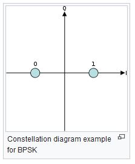
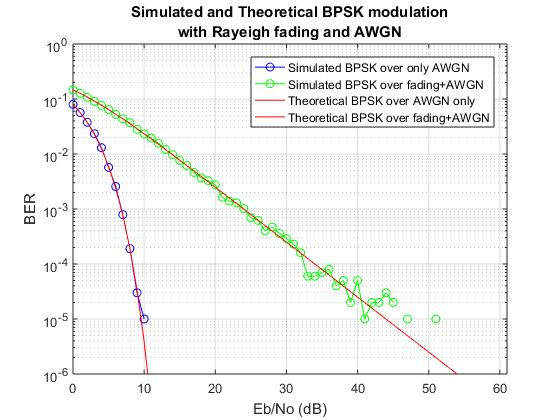

# Simulation of BPSK modulation over a channel

This code Matlab have to objective to simulate a Binary Phase-Shift Keying. This technic is used in Digital Wireless Communication.
We use 2 phases separated by 180° to module our signal, the high phase shift prevents high noise and improve the robustness of the transmission.
The limitation of the binary encoding, is its low transmission rate.
You can find more information on the subject [HERE](https://en.wikipedia.org/wiki/Phase-shift_keying) and [HERE](http://research.iaun.ac.ir/pd/naghsh/pdfs/UploadFile_6840.pdf)

We simulate the signal transmittion, then calculate the error probability
Each simulation increases the signal per energy bit (Eb/No), link between SNR and Eb/No is explained in sources.
*BER1: only AWGN, 
*BER2: fading + AWGN
The simulation uses separate function to help understanding and to keep the wireless communication structure:
Signal Generation->Modulation->Transmission->Demodulation->BER

Programming language:
* Matlab

Do not hesitate if you have any question.
